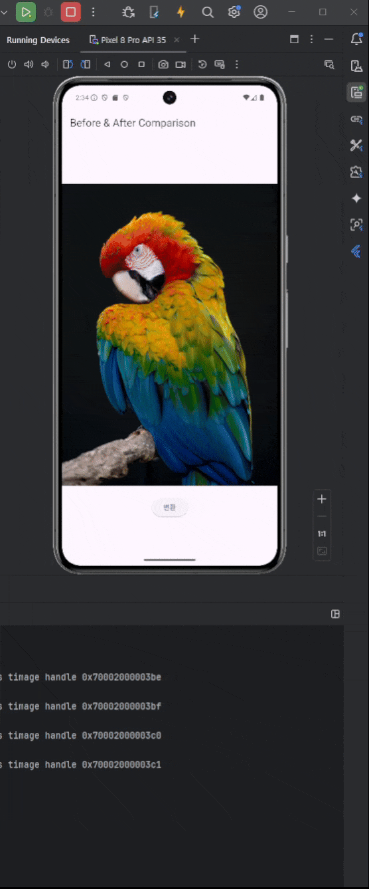

# flutter_cpp_opencv_example(android)

## Example Guide
__[Blog Posting Link](https://cornpip.tistory.com/133)__

## prepare opencv android sdk
[__OpenCV Android Download__ ](https://opencv.org/releases/)
